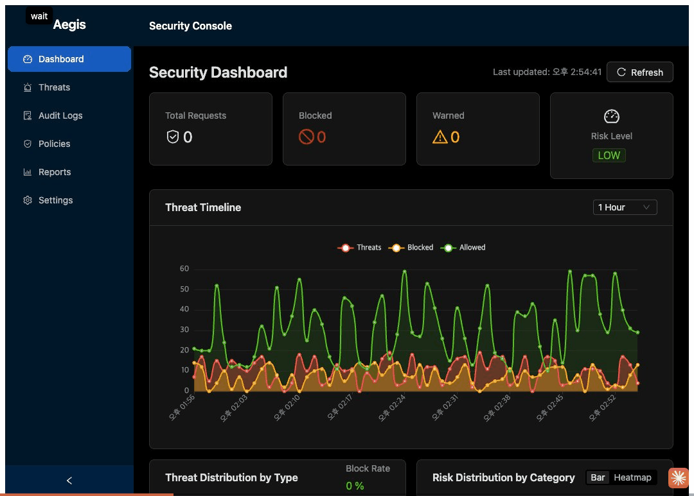

# Aegis - AI/LLM Security Platform

공공기관 AI Agent/RAG 시스템을 위한 런타임 보안 플랫폼

## Overview

Aegis는 오픈망(챗봇) ↔ 폐쇄망(AI Agent/RAG) 분리 환경에서 AI 시스템을 보호하는 2-Tier 보안 솔루션입니다.

```
┌─────────────────────────────────────────────────────────────┐
│  인터넷 (오픈망)                                             │
│  ┌─────────┐    ┌──────────────┐                           │
│  │ 사용자  │───▶│ Aegis-Edge   │  ◀── 1차 방어 (경량)      │
│  └─────────┘    └──────┬───────┘                           │
└────────────────────────┼───────────────────────────────────┘
                         │ 망연계
┌────────────────────────▼───────────────────────────────────┐
│  업무망 (폐쇄망)                                             │
│                  ┌──────────────┐                           │
│                  │ Aegis-Core   │  ◀── 2차 방어 (정밀)      │
│                  └──────┬───────┘                           │
│                         │                                   │
│  ┌─────────┐    ┌───────▼──────┐    ┌─────────┐            │
│  │ API GW  │◀──▶│  AI Agent    │◀──▶│ RAG/DB  │            │
│  └─────────┘    └──────────────┘    └─────────┘            │
└─────────────────────────────────────────────────────────────┘
```

## Demo



*Security Dashboard와 Policy Rules 관리 화면*

## Features

### Aegis-Edge (오픈망)
- Prompt Injection 패턴 탐지
- Jailbreak 시도 차단
- Rate Limiting
- 요청 로깅

### Aegis-Core (폐쇄망)
- 정밀 Injection 분석 (ML 기반)
- RAG 문서 스캔 및 오염 방지
- Agent Tool Call 검증
- Output Guard (PII/민감정보 유출 차단)
- 감사 로깅 및 컴플라이언스

### Aegis-Console
- 실시간 위협 대시보드
- 정책 관리
- 감사 로그 조회
- OWASP LLM Top 10 준수 리포트

## Tech Stack

| Component | Technology |
|-----------|------------|
| Edge/Core | Node.js + TypeScript |
| Console | React + Ant Design + ECharts |
| ML Models | Python + PyTorch + Transformers |
| Database | PostgreSQL (정책) + ClickHouse (로그) |
| Cache | Redis |
| Container | Docker + Kubernetes |

## Quick Start

```bash
# 레포지토리 클론
git clone https://github.com/mhb8436/aegis-ai.git
cd aegis-ai

# 의존성 설치
pnpm install

# 개발 서버 실행
pnpm dev

# Docker 빌드
pnpm docker:build

# Docker 실행
pnpm docker:up
```

## Project Structure

```
aegis/
├── packages/
│   ├── aegis-edge/      # 오픈망 보안 게이트웨이
│   ├── aegis-core/      # 폐쇄망 보안 엔진
│   ├── aegis-console/   # 관리 콘솔
│   └── aegis-common/    # 공통 라이브러리
├── ml/                  # ML 모델
├── deploy/              # 배포 설정
├── docs/                # 문서
└── tests/               # 테스트
```

## Documentation

- [Architecture](./ARCHITECTURE.md) - 상세 기술 설계
- [API Reference](./docs/api/) - API 명세
- [Deployment Guide](./docs/guides/deployment.md) - 배포 가이드
- [Policy Configuration](./docs/guides/policy.md) - 정책 설정

## Security Threats Addressed

Based on OWASP Top 10 for LLM Applications 2025:

| Threat | Coverage |
|--------|----------|
| LLM01: Prompt Injection | Input Guard, Deep Inspector |
| LLM02: Insecure Output Handling | Output Guard |
| LLM07: System Prompt Leakage | Pattern Detection |
| LLM08: Vector/Embedding Weakness | RAG Guard |

## Roadmap

- [x] Phase 1: MVP (Edge + Core 기본)
- [x] Phase 2: RAG 보안 (RAG Guard, RAG Scanner)
- [x] Phase 3: Agent 보안 (Agent Guard, MCP Gateway, LLM Proxy)
- [ ] Phase 4: 엔터프라이즈 기능 (ML 모델, 모니터링, K8s) → `TODO.md` 참조

## License

AGPL-3.0

## Author

CRAFTICSYSTEMS
